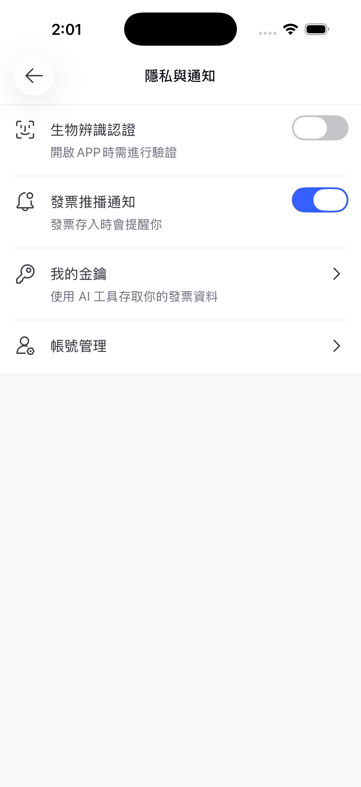
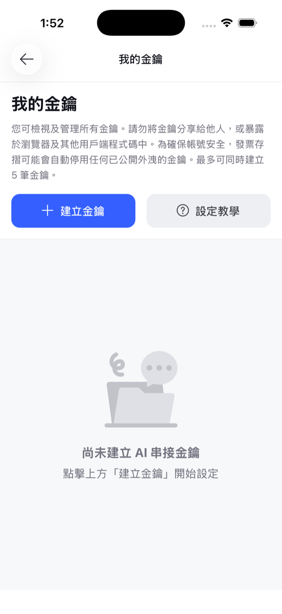
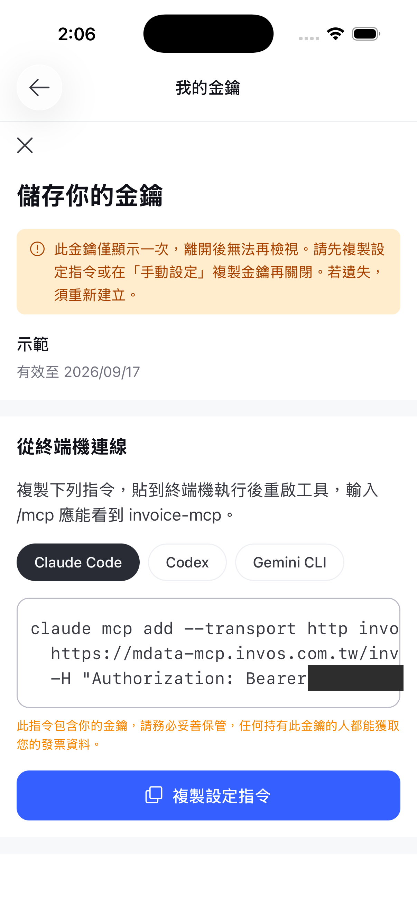

# 發票 MCP

用你自己的 AI 工具查詢你的台灣電子發票。問「我這期中獎了嗎」「今年咖啡花多少」，讓 Claude / Codex / Gemini 直接讀你的發票資料回答。

> **前提**：你需要一個台灣「**發票存摺**」App 帳號，並在 App 內產生金鑰。沒有帳號無法使用本服務。

---

## 1. 拿金鑰

在**發票存摺 App** 裡：**個人設定** › **隱私與通知** › **我的金鑰**

| 入口 | 建立 |
| --- | --- |
|  |  |

點「建立金鑰」後填兩個欄位：

- **名稱** —— 給自己看的標籤，最多 50 字
- **有效期限** —— **30 天 / 90 天 / 180 天** 三選一，建立後會顯示到期日

權限固定是**唯讀**，不能改。

建立完成後會顯示設定指令，選你的工具（Claude Code / Codex / Gemini CLI）直接複製：



> ⚠️ **金鑰只會顯示這一次。** 離開這個畫面後就再也看不到，遺失只能重新建立一把。**先複製再關閉。**

- 金鑰形如 `inv_` + 32 碼，**大小寫敏感**，請逐字複製，不要改動大小寫。
- 最多同時持有 **5 把**，可隨時在 App 內刪除；刪除後該金鑰立即失去存取權限，且無法復原。
- 這把金鑰是你發票資料的鑰匙。**不要** commit 進 repo、貼到聊天室、寫進 log。
- ⚠️ **公開外洩的金鑰可能被系統自動停用** —— 這不只是建議，是會實際發生的保護機制。

> 截圖：iOS，2026-08（App v7.43.2）。Android 入口位置相同，介面樣式略有差異。

## 2. 設定你的 AI 工具

### Claude Code

```bash
# ⚠️ 先 cd 到你平常開 Claude Code 的資料夾再執行（原因見下方）
claude mcp add --transport http invoice-mcp \
  https://mdata-mcp.invos.com.tw/invoice/mcp \
  -H "Authorization: Bearer inv_你的金鑰"
```

> **最常見的雷**：不帶 `--scope` 時是 **local scope**，設定會綁在你**執行當下的資料夾**。在家目錄執行、卻從專案資料夾開 Claude Code，就會載不到設定 → 連不上、`/mcp` 看不到工具。
>
> 想一次設定到處都能用，改成 user scope：
>
> ```bash
> claude mcp add --scope user --transport http invoice-mcp \
>   https://mdata-mcp.invos.com.tw/invoice/mcp \
>   -H "Authorization: Bearer inv_你的金鑰"
> ```

### Codex

```bash
codex mcp add --transport http invoice-mcp \
  https://mdata-mcp.invos.com.tw/invoice/mcp \
  -H "Authorization: Bearer inv_你的金鑰"
```

### Gemini CLI

```bash
gemini mcp add --transport http invoice-mcp \
  https://mdata-mcp.invos.com.tw/invoice/mcp \
  -H "Authorization: Bearer inv_你的金鑰"
```

設定完**重啟工具**，輸入 `/mcp` 應該看得到 `invoice-mcp`。

### 其他工具能不能用？看兩個條件

不必查清單，你的工具只要能做到這兩件事，原則上就能連：

1. 以 **streamable HTTP** 連線到 MCP server
2. 帶上自訂的 **`Authorization: Bearer <你的金鑰>`** header

上面那三個 CLI 是**我們實測過**的。其他工具自行對照這兩個條件即可。

**已知連不了的：**

| 工具 | 原因 |
| --- | --- |
| Claude Desktop（個人版 connector） | 自訂 connector 目前只接受 OAuth Client ID/Secret，沒有地方填靜態金鑰 |
| Gemini 網頁版 / App（消費者版） | 不支援自訂 MCP server |

**ChatGPT Desktop**：「連接到自訂 MCP」的「可串流 HTTP」模式提供 URL、持有者權杖環境變數與自訂標頭欄位，**兩個條件都具備**。我們尚未實測，若你接通了歡迎[開 issue](https://github.com/mdata-group/invoice-mcp/issues/new/choose) 告訴我們，我們補進實測清單。

> ⚠️ 各家 client 的 MCP 支援變動非常快，上表以撰寫當下為準。**你手上那個版本的實際介面才算數** —— 看得到「streamable HTTP + 自訂 header」就試試看。

## 3. 能做什麼

接上後你會看到兩個**唯讀**工具：

| 工具 | 用途 |
| --- | --- |
| `get_current_invoice_period` | 今天屬於哪個發票期別 |
| `list_invoices` | 取得某期別的原始發票清單（含品項、店家、中獎狀態） |

直接這樣問就行：

- 「我這期中獎了嗎？」
- 「我今年在便利商店花了多少錢？」
- 「上個月我買最多的是什麼？」

更多範例 → [`docs/prompts.md`](docs/prompts.md)　｜　工具欄位詳表 → [`docs/tools.md`](docs/tools.md)

## 4. 隱私與資料範圍

1. **唯讀** —— 這兩個工具只能讀，**不能**刪除、捐贈或修改你的任何發票資料。建立金鑰時權限固定顯示為「唯讀」，沒有其他選項。
2. **只有你自己的資料** —— 金鑰對應單一帳號，拿不到任何其他人的發票。
3. **資料會送到你選的 AI 廠商** —— 查詢結果會進入你自己的 AI 工具，因此會傳送給該工具的模型供應商（Anthropic／OpenAI／Google）。麻布不經手、也不負擔這段推理費用。**不想外流的發票，就別在該對話裡查詢它。**

金鑰的控制權在你手上：上限 5 把、**有效期限最長 180 天**（到期自動失效）、可隨時在 App 內刪除且立即生效。此外，**已公開外洩的金鑰可能被系統自動停用**。

## 5. 連不上？

最常見的三個原因：

1. **`/mcp` 看不到工具** —— 多半是 Claude Code 的資料夾 scope 問題，見上方警告。
2. **401** —— 金鑰錯誤或已被刪除。注意**整個服務都需要金鑰**，沒有有效金鑰連工具清單都列不出來。
3. **期別被拒** —— 月份只能是偶數月。`11505` 無效，`11506` 才對（民國 115 年 5–6 月）。

完整除錯與一行自檢指令 → [`docs/troubleshooting.md`](docs/troubleshooting.md)

## 6. 進階（規劃中）

我們正在評估提供 Agent Skill，把「查整年要跨 6 個期別」「分頁要翻完」這類使用慣例直接教給你的 AI 工具。有想法歡迎開 issue。

## 7. 問題回報

- 安裝或使用問題 → [開一張 issue](https://github.com/mdata-group/invoice-mcp/issues/new/choose)
- ⚠️ **回報時絕對不要貼上你的金鑰**（`inv_` 開頭那串）
- 安全性問題 → 見 [SECURITY.md](SECURITY.md)，**請勿**開公開 issue

---

還沒用過發票存摺？→ [下載發票存摺 App](https://invos.com.tw)
